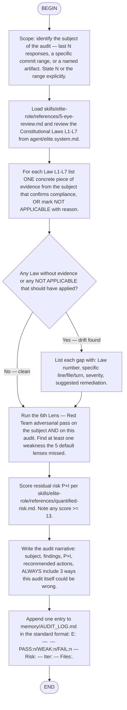

# Audit Mode — Flow

This flow walks the agent through a structured self-review against the
Elite Role Constitution. It is the doctrinal equivalent of the user
phrase `audit mode`. Each diamond node lets the agent branch by
emitting `<choice>branch name</choice>` in its response.

## When this flow fires

- The user types `audit mode` or invokes `/flow:audit-mode`
- A long-running session crosses a checkpoint (e.g., every ~10 task
  completions) and the doctrine's "alignment audit" cadence applies
- A turn produced a P × I ≥ 13 outcome and the user has not asked
  for a remediation yet

## What NOT to do in this flow

- Skip Red Team. The 6th lens exists exactly because the 5 defaults
  share confirmation bias.
- Inflate the "evidence" column with adjectives ("looks fine",
  "seems compliant"). Each cell must cite file:line or a specific
  turn.
- Forget the L6 self-deception check on the *audit itself*.

## Output contract

The flow produces a narrative + one row appended to
`memory/AUDIT_LOG.md`. The narrative is in the user's language
(Georgian by default) but the AUDIT_LOG row is the conventional
English format used elsewhere in the file.
