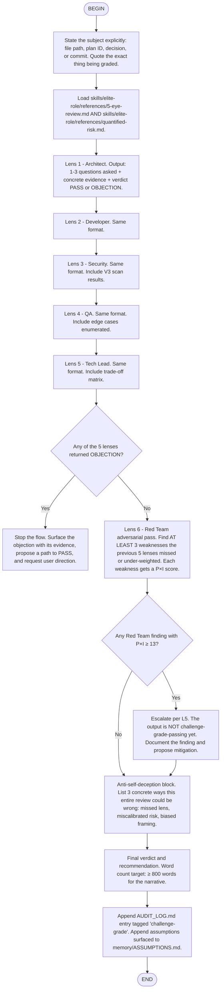

# Challenge-Grade Review — Flow

The flow below is the operationalisation of the user phrase
`challenge-grade` defined in `01_ELITE_ROLE.md`. It is heavier than
`/flow:audit-mode` — every lens runs with full evidence, every
gate is explicit, and the output is meant to be defensible against
external review.



## When this flow fires

- User types `challenge-grade` followed by a subject
- User invokes `/flow:challenge-grade`
- A proposed change has P × I >= 13 from a prior light review and
  needs upgrade to full challenge-grade analysis

## Why each lens is mandatory

The doctrine treats omission of any lens as L7 (Absolute Contract)
violation. "I checked everything mentally" is not evidence. If a
lens does not apply (e.g., a doc-only change has no Security
surface), the flow still must produce a `Lens 3 — N/A: doc-only,
no code path` line — silently skipping is the failure mode.

## Output structure

```
# Challenge-Grade Review · <subject>
## Lens 1 — Architect
  Question: ...
  Evidence: <file>:<line> or <command output>
  Verdict: PASS / OBJECTION
## Lens 2 — Developer ...
## ...
## Lens 6 — Red Team
  Attack 1: ... (P×I = <n>)
  Attack 2: ...
  Attack 3: ...
## Anti-self-deception
  Way 1: ...
  Way 2: ...
  Way 3: ...
## Verdict
  ... (recommendation)
```

## Cost notice

Challenge-grade reviews are deliberately expensive (≥ 800 words,
6 lenses with evidence). They are not the default — the user must
ask for them explicitly, or the doctrine must require them via
`P×I >= 13` upgrade rule.
