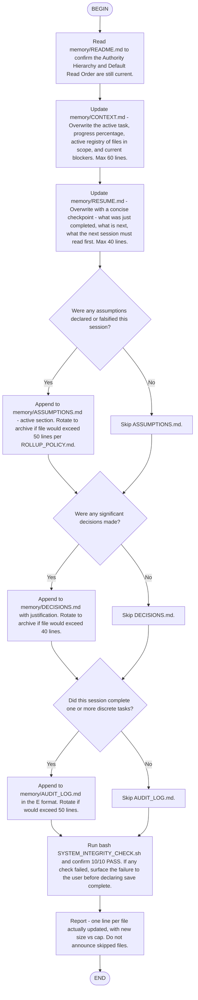

# Save-State — Flow

This flow makes explicit the "memory autosave" ritual described in
`SESSION_RITUAL.md`. The flow updates each active memory file
deterministically; the `SessionEnd` hook covers the case where the
user forgets to invoke it.

## When this flow fires

- User types `save state`
- User invokes `/flow:save-state`
- Pre-compact ritual (SESSION_RITUAL.md Ritual 3) reaches its
  save step
- Detected risk that the session may end soon (e.g., long-running
  task at >= 80% completion and user has not interacted in a while)

## Why threshold compliance is mandatory

Every memory file has a self-declared `Max Size: N lines`. Writing
past the cap without rotating violates the file's own contract.
`SYSTEM_INTEGRITY_CHECK.sh` checks #3 and #10 enforce this; the
save-state flow must respect the same constraints.

## Side effects out of scope

- This flow does NOT touch the agent's session id or `--session`
  semantics. Kimi CLI 1.43+ handles those natively.
- This flow does NOT trigger `/compact`. That is a separate user
  decision; the pre-compact ritual is its own flow if one is
  written later.
